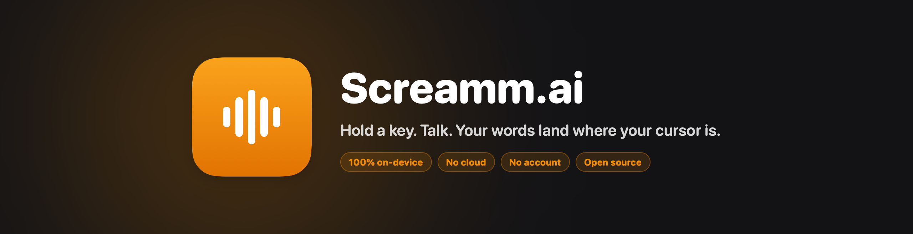

<div align="center">



<br>

**Voice-to-text for macOS that never phones home.**

Hold Right ⌘, say what you mean, let go. Polished text appears wherever your cursor already was — your editor, Slack, a form field, anywhere. The audio is transcribed on your own Neural Engine and thrown away.

An open-source alternative to Wispr Flow.

<br>


</div>

<br>

## Why this exists

Dictation tools are fast and good now. They are also, almost without exception, microphones pointed at someone else's servers.

Screamm is the other trade. Whisper `large-v3-turbo` runs on the Apple Neural Engine, on your machine. There is no API key to paste, no account to make, no usage dashboard, no opt-out buried in settings. **1.83 s** to transcribe a held phrase on an M2 Pro, warm.

If you dictate anything you would not paste into a stranger's text box — client work, medical notes, an unreleased product, a hard email — this is the one you want.

<br>

## What it feels like

<div align="center">

</div>

Hold **Right ⌘**. A pill slides up from the bottom of the screen and shows your voice as you speak. Let go. It pulses while it thinks, flashes a green check, and your text is already in the field. No window to focus, no button to click, no transcript to copy.

<br>

## What's in it

| | |
|---|---|
| 🎙 **Hold to talk** | Right ⌘ down to record, up to paste. Works in every app, including ones that block other tools. |
| 🧠 **On-device Whisper** | `large-v3-turbo` on the ANE. The model downloads once; after that you can pull the ethernet cable. |
| ✍️ **Cleanup that isn't annoying** | Strips "um" and "uh", fixes capitalization and spacing, understands "new line" and "new paragraph". |
| 📋 **Spoken lists** | "First, buy milk. Second, call mom." comes out as a real numbered list. |
| 💻 **Per-app code mode** | In Xcode, VS Code, or a terminal it stops capitalizing, so you get `func`, not `Func`. |
| 📖 **Custom dictionary** | Teach it the names and jargon it always gets wrong. Whole-word, case-insensitive. |
| 🔥 **Streaks** | Words dictated, time saved, a day counter. Stored in a JSON file on your disk and nowhere else. |
| 🤫 **Silence gates** | Three of them, so a stray key-hold never types "Thank you." at your boss. |
| 🌍 **Multilingual** | Whisper auto-detects the language you speak. |

<br>

## Install

Requires an Apple Silicon Mac on macOS 14+, and Xcode to build.

```bash
git clone https://github.com/ElMammoth/screamm.ai.git
cd screamm.ai
./Scripts/make-cert.sh                                       # once — see below
SCREAMM_CERT="Screamm Self-Signed" ./Scripts/build-app.sh
open ./Screamm.app
```

Grant **Microphone** and **Accessibility** when asked, wait for the one-time model download, and look for the mic in your menu bar. Then hold Right ⌘ and say something.

<details>
<summary><b>Why the certificate step?</b></summary>

<br>

macOS ties Accessibility and Microphone permission to an app's code signature. Ad-hoc signing (`codesign -s -`) produces a new signature on every build, so macOS treats each rebuild as a brand-new app and makes you re-grant permission every single time.

`make-cert.sh` creates a stable self-signed certificate so the signature stays constant and your permissions stick. It costs nothing and needs no Apple Developer account. A notarized release build is a separate, later milestone.

</details>

<details>
<summary><b>Uninstalling, and where your data lives</b></summary>

<br>

Everything Screamm keeps is in two places:

```
~/Library/Application Support/Screamm/     # streak, dictionary, per-app settings (plain JSON)
~/Documents/huggingface/                    # the downloaded Whisper model
```

Delete those two folders and the `.app`, and nothing remains. No launch agents, no login items, no receipts.

</details>

<br>

## How it works

```
  Right ⌘ (hold)
        │
        ▼
  HotkeyManager ───▶ AudioRecorder ───▶ WhisperKitTranscriber ───▶ CleanupPipeline ───▶ ClipboardInjector
  NSEvent monitor    AVAudioEngine      large-v3-turbo             fillers, commands,   clipboard + ⌘V,
  + lost-release     → 16 kHz mono      resident + warm            capitalization,      then restores your
  watchdog           Float buffer       on the ANE                 lists, dictionary    old clipboard
        │
        └──────────────── RecordingCoordinator (idle → recording → transcribing → injecting) ──────────────┘
```

Audio exists as a `Float` buffer in memory and is released the moment transcription returns. It is never written to disk. The only network call Screamm ever makes is the one-time model download.

<br>

## Repo layout

```
Sources/
  ScreammKit/          the logic + macOS integrations — all of this is unit-tested
    Core/              protocol seams + RecordingCoordinator (the state machine)
    Audio/             AVAudioEngine tap, silence detection
    Transcription/     WhisperKit wrapper (load states, warm-up)
    Cleanup/           the text pipeline + spoken-list formatter
    Dictionary/        user replacements
    Context/           per-app code mode
    Stats/             streak + milestones
    Injection/         clipboard paste with secure-input guard
    Hotkey/            Right ⌘ detection + lost-release watchdog
  Screamm/             the thin menu-bar app (SwiftUI)
Tests/                 74 tests, `swift test`
Scripts/               make-cert.sh, build-app.sh, make-icon.sh
```

```bash
swift build     # compile
swift test      # 74 tests, ~5s
```

<br>

## Status

Working and dogfooded daily. Personal-first: built for one person's Mac before it is built for everyone's.

Honest about what's rough — open bugs and the roadmap live in [`TODOS.md`](TODOS.md), and the running build log is in [`PROGRESS.md`](PROGRESS.md). A notarized release with a Homebrew cask is the next real milestone.

<br>

## Contributing

Issues and PRs welcome. Two rules that aren't negotiable:

1. **Nothing leaves the device.** No analytics, no crash reporting, no "anonymous" usage pings, no remote config. Not behind a flag, not opt-in.
2. **Logic goes in `ScreammKit` with a test.** The UI is dogfooded by hand; the text pipeline and the state machine are not.

<br>

## License

MIT. See [LICENSE](LICENSE).

<div align="center">
<br>
<sub>Built by <a href="https://github.com/ElMammoth">ElMammoth</a> · Powered by <a href="https://github.com/argmaxinc/WhisperKit">WhisperKit</a></sub>
</div>
